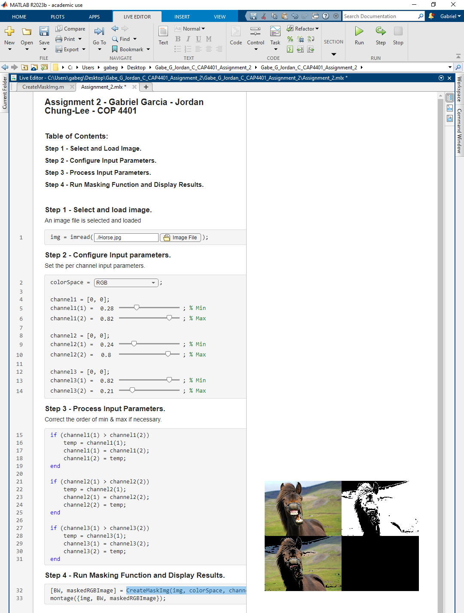

# Gabe_G_Jordan_C_CAP4401_Assignment_2
MATLAB Assignment 1 for CAP 4401 - Gabriel Garcia (Z23643475) & Jordan Chung-Lee

Any desired image (as long as the format is supported) can be loaded via the LiveScript file browser.

The color space can be choosen from the drop down and the min and max of each color channel can be controlled with the 3 pairs of sliders.